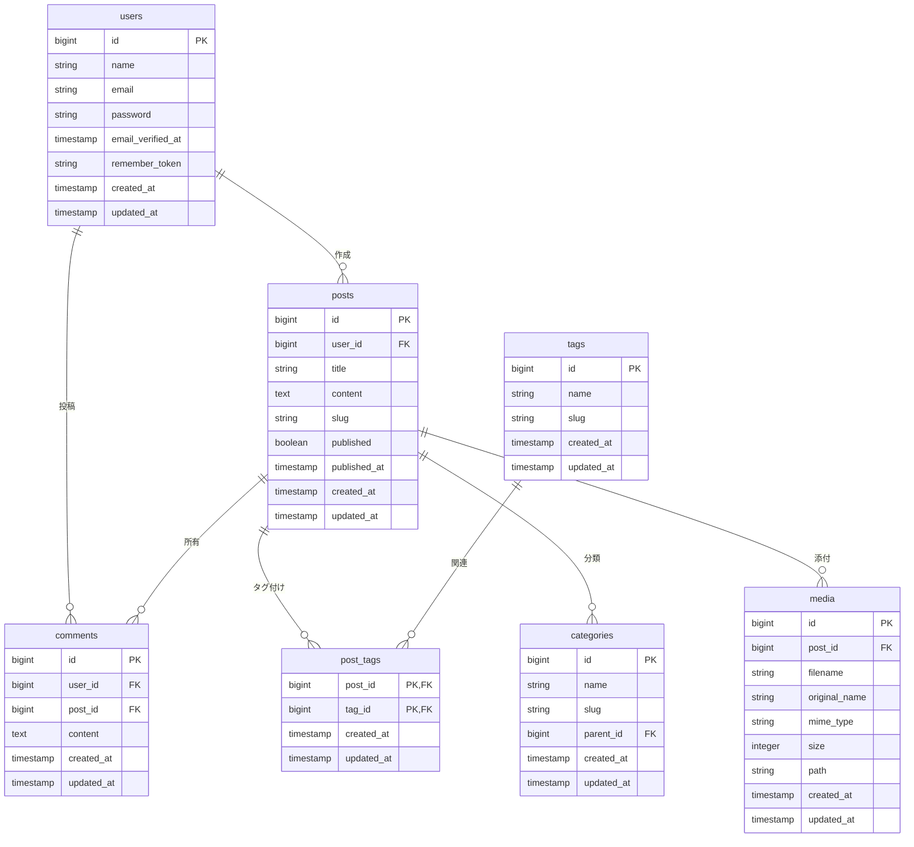

# データベーススキーマ

## スキーマ図

## テーブル詳細

### users
ユーザー情報を管理するテーブル

| カラム名 | 型 | 説明 |
|---------|----|------|
| id | bigint | 主キー |
| name | string | ユーザー名 |
| email | string | メールアドレス |
| password | string | ハッシュ化されたパスワード |
| email_verified_at | timestamp | メール確認日時 |
| remember_token | string | リメンバートークン |
| created_at | timestamp | 作成日時 |
| updated_at | timestamp | 更新日時 |

### posts
ブログ記事を管理するテーブル

| カラム名 | 型 | 説明 |
|---------|----|------|
| id | bigint | 主キー |
| user_id | bigint | 作成者ID（外部キー） |
| title | string | 記事タイトル |
| content | text | 記事本文 |
| slug | string | URL用スラッグ |
| published | boolean | 公開状態 |
| published_at | timestamp | 公開日時 |
| created_at | timestamp | 作成日時 |
| updated_at | timestamp | 更新日時 |

### comments
コメントを管理するテーブル

| カラム名 | 型 | 説明 |
|---------|----|------|
| id | bigint | 主キー |
| user_id | bigint | 投稿者ID（外部キー） |
| post_id | bigint | 記事ID（外部キー） |
| content | text | コメント本文 |
| created_at | timestamp | 作成日時 |
| updated_at | timestamp | 更新日時 |

### tags
タグを管理するテーブル

| カラム名 | 型 | 説明 |
|---------|----|------|
| id | bigint | 主キー |
| name | string | タグ名 |
| slug | string | URL用スラッグ |
| created_at | timestamp | 作成日時 |
| updated_at | timestamp | 更新日時 |

### post_tags
記事とタグの関連を管理するテーブル

| カラム名 | 型 | 説明 |
|---------|----|------|
| post_id | bigint | 記事ID（外部キー） |
| tag_id | bigint | タグID（外部キー） |
| created_at | timestamp | 作成日時 |
| updated_at | timestamp | 更新日時 |

### categories
カテゴリを管理するテーブル

| カラム名 | 型 | 説明 |
|---------|----|------|
| id | bigint | 主キー |
| name | string | カテゴリ名 |
| slug | string | URL用スラッグ |
| parent_id | bigint | 親カテゴリID（外部キー） |
| created_at | timestamp | 作成日時 |
| updated_at | timestamp | 更新日時 |

### media
メディアファイルを管理するテーブル

| カラム名 | 型 | 説明 |
|---------|----|------|
| id | bigint | 主キー |
| post_id | bigint | 記事ID（外部キー） |
| filename | string | ファイル名 |
| original_name | string | 元のファイル名 |
| mime_type | string | MIMEタイプ |
| size | integer | ファイルサイズ |
| path | string | ファイルパス |
| created_at | timestamp | 作成日時 |
| updated_at | timestamp | 更新日時 |

## インデックス

### users
- PRIMARY KEY (id)
- UNIQUE KEY (email)
- INDEX (remember_token)

### posts
- PRIMARY KEY (id)
- INDEX (user_id)
- INDEX (slug)
- INDEX (published, published_at)

### comments
- PRIMARY KEY (id)
- INDEX (user_id)
- INDEX (post_id)

### tags
- PRIMARY KEY (id)
- UNIQUE KEY (slug)

### post_tags
- PRIMARY KEY (post_id, tag_id)
- INDEX (tag_id)

### categories
- PRIMARY KEY (id)
- UNIQUE KEY (slug)
- INDEX (parent_id)

### media
- PRIMARY KEY (id)
- INDEX (post_id) 