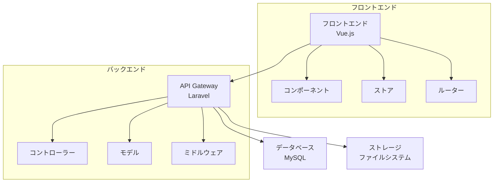

# システム概要

## アーキテクチャ図

## システム構成

### フロントエンド
- Vue.js 3.x
- Vue Router
- Pinia (状態管理)
- Tailwind CSS
- Vite (ビルドツール)

### バックエンド
- Laravel 10.x
- PHP 8.2+
- MySQL 8.0+

### 開発環境
- Node.js 18+
- Composer
- npm/yarn

## 主要機能

1. ユーザー管理
   - 認証・認可
   - プロフィール管理
   - 権限管理

2. ブログ機能
   - 記事の作成・編集・削除
   - カテゴリ管理
   - タグ管理
   - コメント機能

3. メディア管理
   - 画像アップロード
   - ファイル管理
   - ストレージ管理

## セキュリティ

- JWT認証
- CSRF保護
- XSS対策
- SQLインジェクション対策
- レート制限

## パフォーマンス

- キャッシュ戦略
- データベース最適化
- アセット最適化
- 遅延読み込み

## 監視とログ

- エラーログ
- アクセスログ
- パフォーマンスモニタリング
- セキュリティ監視 