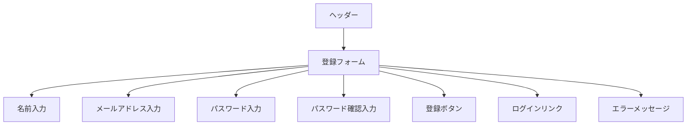
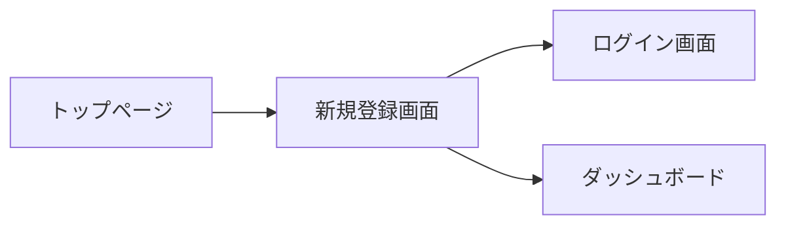

# 新規登録画面仕様書

## 1. 概要
- **目的**: 新規ユーザーの登録を行う
- **主要機能**: ユーザー情報の入力と登録
- **対象ユーザー**: 未登録ユーザー

## 2. 画面レイアウト


## 3. 画面遷移


## 4. 機能一覧
| 機能ID | 機能名 | 説明 | 優先度 |
|--------|--------|------|--------|
| REG001 | ユーザー登録 | 新規ユーザー情報の登録 | 高 |
| REG002 | ログイン遷移 | ログイン画面への遷移 | 中 |
| REG003 | エラー表示 | 登録エラーの表示 | 高 |

## 5. 入力項目
| 項目ID | 項目名 | 型 | 必須 | バリデーション | 備考 |
|--------|--------|----|------|--------------|------|
| REG001 | 名前 | text | 必須 | 最大255文字 | - |
| REG002 | メールアドレス | email | 必須 | メール形式、最大255文字、重複不可 | - |
| REG003 | パスワード | password | 必須 | 最小8文字、確認用パスワードと一致 | - |
| REG004 | パスワード確認 | password | 必須 | REG003と一致 | - |

## 6. エラーメッセージ
| エラーコード | メッセージ | 発生条件 |
|-------------|-----------|----------|
| REG001 | このメールアドレスは既に使用されています | メールアドレス重複 |
| REG002 | 名前を入力してください | 名前未入力 |
| REG003 | メールアドレスを入力してください | メールアドレス未入力 |
| REG004 | パスワードを入力してください | パスワード未入力 |
| REG005 | パスワードは8文字以上で入力してください | パスワード長不足 |
| REG006 | パスワードが一致しません | パスワード不一致 |

## 7. アクセシビリティ要件
- キーボード操作で全ての機能が利用可能
- スクリーンリーダー対応
- 色のコントラスト比4.5:1以上
- エラーメッセージは視覚的かつ音声で通知
- フォームの各項目に適切なラベルと説明文を付与

## 8. セキュリティ要件
- CSRFトークンの検証（Laravelデフォルト）
- パスワード入力欄はマスク表示
- パスワードの暗号化（bcrypt）
- セキュアなCookie設定（Laravelデフォルト）

## 9. パフォーマンス要件
- ページロード時間: 2秒以内
- フォーム送信後のレスポンス時間: 1秒以内
- エラーメッセージの表示時間: 0.5秒以内

## 10. コンポーネント設計

### 10.1 登録フォーム
```vue
<template>
  <form @submit.prevent="handleRegister">
    <div class="form-group">
      <label for="name">名前</label>
      <input
        id="name"
        v-model="name"
        type="text"
        required
        :disabled="loading"
      >
    </div>
    <div class="form-group">
      <label for="email">メールアドレス</label>
      <input
        id="email"
        v-model="email"
        type="email"
        required
        :disabled="loading"
      >
    </div>
    <div class="form-group">
      <label for="password">パスワード</label>
      <input
        id="password"
        v-model="password"
        type="password"
        required
        :disabled="loading"
      >
    </div>
    <div class="form-group">
      <label for="password_confirmation">パスワード（確認）</label>
      <input
        id="password_confirmation"
        v-model="passwordConfirmation"
        type="password"
        required
        :disabled="loading"
      >
    </div>
    <button
      type="submit"
      :disabled="loading"
    >
      {{ loading ? '登録中...' : '登録' }}
    </button>
    <div v-if="error" class="error-message">
      {{ error }}
    </div>
  </form>
</template>
```

### 10.2 状態管理
```typescript
interface RegisterState {
  name: string;
  email: string;
  password: string;
  passwordConfirmation: string;
  loading: boolean;
  error: string | null;
}

const state = reactive<RegisterState>({
  name: '',
  email: '',
  password: '',
  passwordConfirmation: '',
  loading: false,
  error: null
});
```

### 10.3 メソッド
```typescript
const handleRegister = async () => {
  state.loading = true;
  state.error = null;
  
  try {
    await authStore.register({
      name: state.name,
      email: state.email,
      password: state.password,
      password_confirmation: state.passwordConfirmation
    });
    router.push('/dashboard');
  } catch (error) {
    state.error = '登録に失敗しました。';
  } finally {
    state.loading = false;
  }
};
``` 