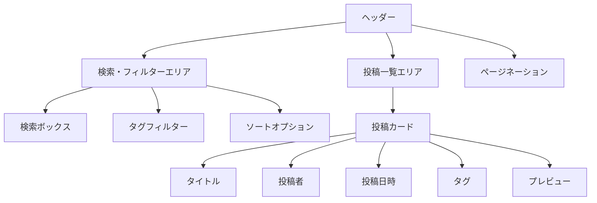
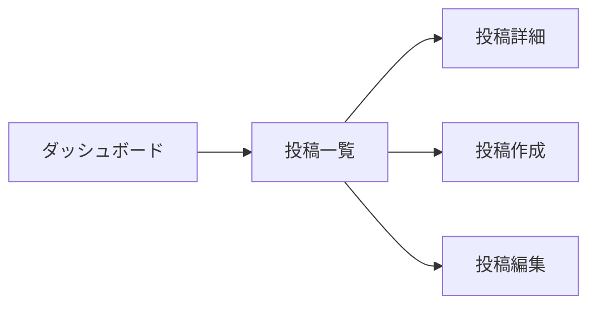

# 投稿一覧画面仕様書

## 1. 概要
- **目的**: 投稿の一覧表示と検索・フィルタリング機能の提供
- **主要機能**: 投稿一覧表示、検索、フィルタリング、ページネーション
- **対象ユーザー**: ログインユーザー

## 2. 画面レイアウト

## 3. 画面遷移

## 4. 機能一覧
| 機能ID | 機能名 | 説明 | 優先度 |
|--------|--------|------|--------|
| POST001 | 投稿一覧表示 | 投稿の一覧を表示 | 高 |
| POST002 | 検索機能 | キーワードによる検索 | 高 |
| POST003 | タグフィルター | タグによるフィルタリング | 中 |
| POST004 | ソート機能 | 投稿の並び替え | 中 |
| POST005 | ページネーション | ページ切り替え | 高 |

## 5. 表示項目
| 項目ID | 項目名 | 型 | 表示条件 | 備考 |
|--------|--------|----|----------|------|
| POST001 | タイトル | text | 常時 | 最大100文字 |
| POST002 | 投稿者 | text | 常時 | ユーザー名 |
| POST003 | 投稿日時 | datetime | 常時 | YYYY/MM/DD HH:mm |
| POST004 | タグ | array | タグあり | 最大5個 |
| POST005 | プレビュー | text | 常時 | 本文の最初の100文字 |

## 6. 検索・フィルター条件
| 条件ID | 条件名 | 型 | 説明 |
|--------|--------|----|------|
| SEARCH001 | キーワード | text | タイトル・本文・タグを検索 |
| FILTER001 | タグ | array | 選択したタグを含む投稿を表示 |
| SORT001 | 並び順 | select | 新着順/古い順/人気順 |

## 7. エラーメッセージ
| エラーコード | メッセージ | 発生条件 |
|-------------|-----------|----------|
| POST001 | 投稿の取得に失敗しました | APIエラー |
| POST002 | 検索条件が不正です | 検索パラメータエラー |
| POST003 | フィルター条件が不正です | フィルターパラメータエラー |

## 8. アクセシビリティ要件
- キーボード操作で全ての機能が利用可能
- スクリーンリーダー対応
- 色のコントラスト比4.5:1以上
- 画像には代替テキストを設定
- タブ順序の最適化

## 9. パフォーマンス要件
- 初期表示時間: 2秒以内
- 検索・フィルター適用時間: 1秒以内
- ページネーション切り替え時間: 0.5秒以内
- 無限スクロール対応（オプション）

## 10. レスポンシブ対応
- デスクトップ: 4列グリッド
- タブレット: 2列グリッド
- モバイル: 1列リスト
- ブレークポイント:
  - デスクトップ: 1024px以上
  - タブレット: 768px-1023px
  - モバイル: 767px以下 