# 画面設計書

## 1. ホーム画面（/）

### 1.1 画面構造
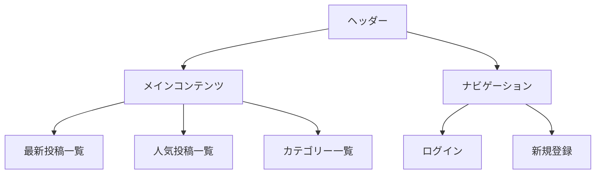

### 1.2 DBへのI/O
- **参照**
  - 最新投稿一覧（postsテーブル）
  - 人気投稿一覧（postsテーブル、likesテーブル）
  - カテゴリー一覧（categoriesテーブル）

### 1.3 画面遷移
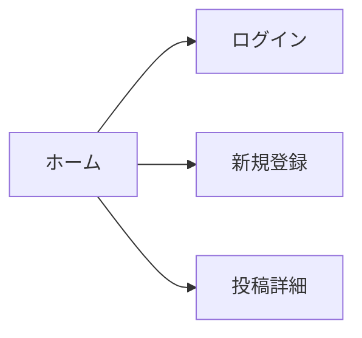

### 1.4 詳細仕様

#### 1.4.1 最新投稿一覧
- **表示件数**: 10件
- **表示項目**:
  - タイトル
  - 投稿者名
  - 投稿日時
  - カテゴリー
  - いいね数
- **ソート順**: 投稿日時の降順
- **ページネーション**: あり

#### 1.4.2 人気投稿一覧
- **表示件数**: 5件
- **表示項目**:
  - タイトル
  - 投稿者名
  - 投稿日時
  - カテゴリー
  - いいね数
- **ソート順**: いいね数の降順
- **集計期間**: 過去1週間

#### 1.4.3 カテゴリー一覧
- **表示形式**: タグ形式
- **表示項目**:
  - カテゴリー名
  - 投稿数
- **ソート順**: 投稿数の降順

#### 1.4.4 ヘッダー
- **ロゴ**: アプリケーション名
- **ナビゲーション**:
  - ログイン（未ログイン時）
  - 新規登録（未ログイン時）
  - 検索ボックス

#### 1.4.5 レスポンシブ対応
- **PC**: 3カラムレイアウト
- **タブレット**: 2カラムレイアウト
- **スマートフォン**: 1カラムレイアウト

## 2. ログイン画面（/login）

### 2.1 画面構造
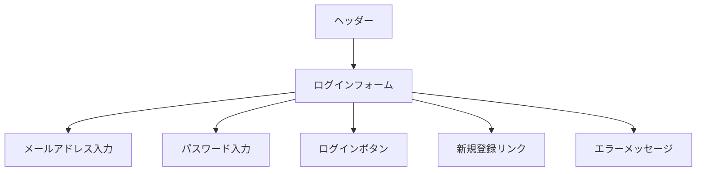

### 2.2 DBへのI/O
- **参照**
  - ユーザー認証（usersテーブル）

### 2.3 画面遷移
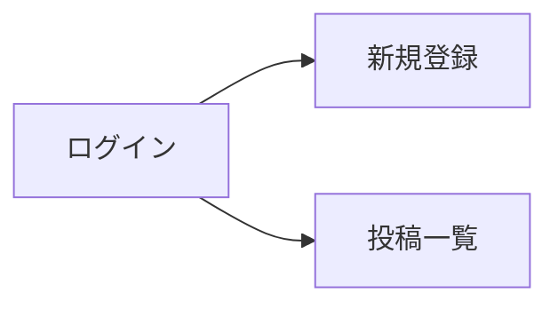

### 2.4 詳細仕様

#### 2.4.1 ログインフォーム
- **メールアドレス入力**
  - 型: email
  - 必須: はい
  - バリデーション:
    - メールアドレス形式
    - 最大255文字
  - プレースホルダー: "メールアドレスを入力してください"

- **パスワード入力**
  - 型: password
  - 必須: はい
  - バリデーション:
    - 最小8文字
  - プレースホルダー: "パスワードを入力してください"

- **ログインボタン**
  - ラベル: "ログイン"
  - 状態:
    - 通常: 有効
    - ローディング中: 無効
  - クリック時: ログイン処理実行

#### 2.4.2 エラーメッセージ
- **表示位置**: フォーム上部
- **表示タイミング**:
  - 認証失敗時
  - バリデーションエラー時
- **スタイル**: 赤色のテキスト

#### 2.4.3 新規登録リンク
- **表示位置**: フォーム下部
- **テキスト**: "アカウントをお持ちでない方はこちら"
- **遷移先**: 新規登録画面

#### 2.4.4 レスポンシブ対応
- **PC**: 中央配置、幅400px
- **タブレット**: 中央配置、幅90%
- **スマートフォン**: 中央配置、幅90%

## 3. 新規登録画面（/register）

### 3.1 画面構造
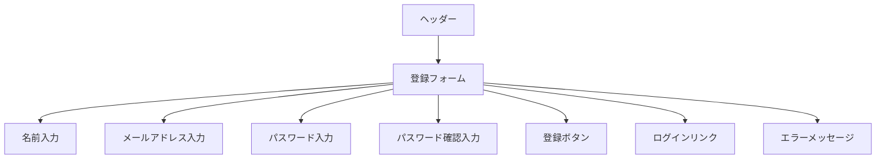

### 3.2 DBへのI/O
- **登録**
  - ユーザー情報（usersテーブル）

### 3.3 画面遷移
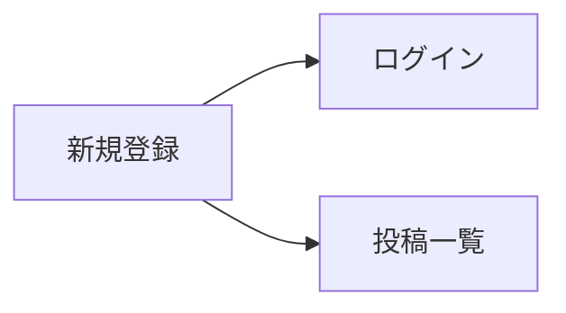

### 3.4 詳細仕様

#### 3.4.1 登録フォーム
- **名前入力**
  - 型: text
  - 必須: はい
  - バリデーション:
    - 最大255文字
  - プレースホルダー: "お名前を入力してください"

- **メールアドレス入力**
  - 型: email
  - 必須: はい
  - バリデーション:
    - メールアドレス形式
    - 最大255文字
    - 重複チェック
  - プレースホルダー: "メールアドレスを入力してください"

- **パスワード入力**
  - 型: password
  - 必須: はい
  - バリデーション:
    - 最小8文字
    - 英数字混合
  - プレースホルダー: "パスワードを入力してください"

- **パスワード確認入力**
  - 型: password
  - 必須: はい
  - バリデーション:
    - パスワードと一致
  - プレースホルダー: "パスワードを再入力してください"

- **登録ボタン**
  - ラベル: "登録"
  - 状態:
    - 通常: 有効
    - ローディング中: 無効
  - クリック時: 登録処理実行

#### 3.4.2 エラーメッセージ
- **表示位置**: フォーム上部
- **表示タイミング**:
  - バリデーションエラー時
  - 登録失敗時
- **スタイル**: 赤色のテキスト

#### 3.4.3 ログインリンク
- **表示位置**: フォーム下部
- **テキスト**: "すでにアカウントをお持ちの方はこちら"
- **遷移先**: ログイン画面

#### 3.4.4 レスポンシブ対応
- **PC**: 中央配置、幅400px
- **タブレット**: 中央配置、幅90%
- **スマートフォン**: 中央配置、幅90%

## 4. 投稿一覧画面（/posts）

### 4.1 画面構造
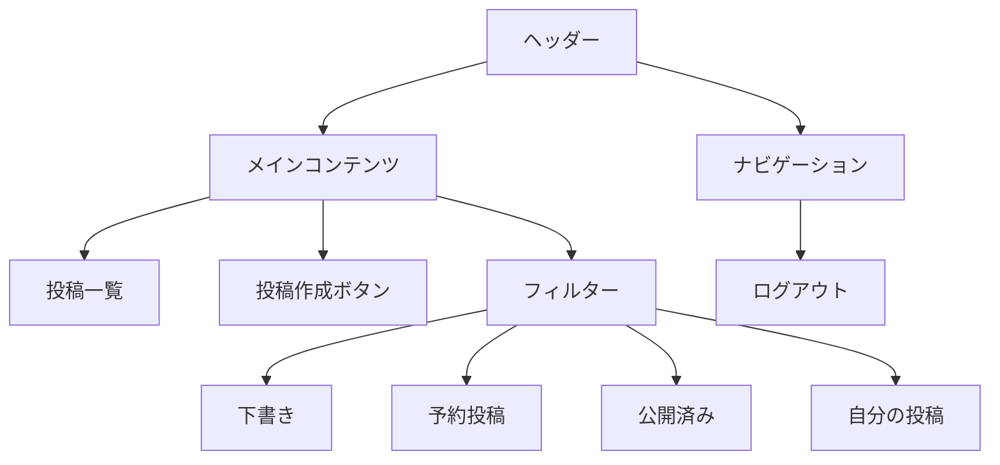

### 4.2 DBへのI/O
- **参照**
  - 投稿一覧（postsテーブル）
  - ユーザー情報（usersテーブル）
  - いいね情報（likesテーブル）

### 4.3 画面遷移
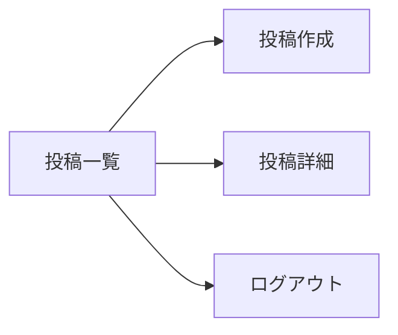

### 4.4 詳細仕様

#### 4.4.1 投稿一覧
- **表示件数**: 20件/ページ
- **表示項目**:
  - タイトル
  - 投稿者名
  - 投稿日時
  - カテゴリー
  - いいね数
  - ステータス（下書き/公開/予約）
- **ソート順**: 投稿日時の降順
- **ページネーション**: あり
- **表示形式**: カード形式

#### 4.4.2 フィルター
- **ステータスフィルター**:
  - 下書き
  - 予約投稿
  - 公開済み
- **表示フィルター**:
  - 自分の投稿
  - 全ユーザーの投稿
- **カテゴリーフィルター**:
  - カテゴリー選択ドロップダウン
- **検索フィルター**:
  - タイトル検索
  - 本文検索

#### 4.4.3 投稿作成ボタン
- **表示位置**: 画面右上
- **ラベル**: "新規投稿"
- **アイコン**: プラスアイコン
- **クリック時**: 投稿作成画面へ遷移

#### 4.4.4 ヘッダー
- **ロゴ**: アプリケーション名
- **ナビゲーション**:
  - ログアウト
  - ユーザー名表示
  - プロフィールリンク

#### 4.4.5 レスポンシブ対応
- **PC**: 2カラムレイアウト
  - メイン: 投稿一覧
  - サイド: フィルター
- **タブレット**: 1カラムレイアウト
  - フィルターは上部に配置
- **スマートフォン**: 1カラムレイアウト
  - フィルターはドロップダウンメニュー

#### 4.4.6 アクション
- **投稿カードクリック**: 投稿詳細画面へ遷移
- **いいねボタン**: いいねの追加/削除
- **編集ボタン**: 投稿編集画面へ遷移
- **削除ボタン**: 削除確認ダイアログ表示

## 5. 投稿作成画面（/posts/create）

### 5.1 画面構造
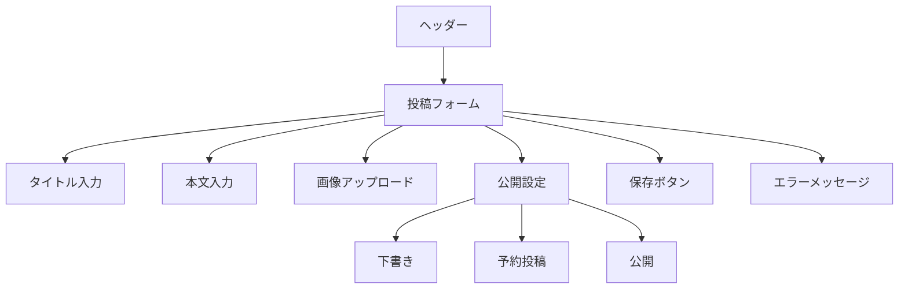

### 5.2 DBへのI/O
- **登録**
  - 投稿情報（postsテーブル）
  - 画像情報（imagesテーブル）

### 5.3 画面遷移
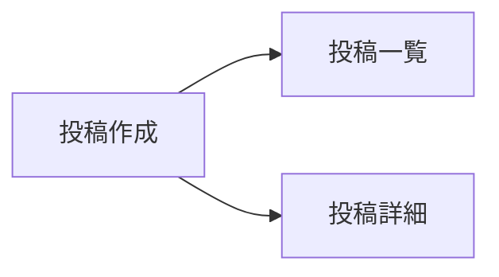

### 5.4 詳細仕様

#### 5.4.1 投稿フォーム
- **タイトル入力**
  - 型: text
  - 必須: はい
  - バリデーション:
    - 最大255文字
  - プレースホルダー: "タイトルを入力してください"

- **本文入力**
  - 型: textarea
  - 必須: はい
  - バリデーション:
    - 最大10000文字
  - プレースホルダー: "本文を入力してください"
  - エディタ機能:
    - リッチテキスト編集
    - 画像挿入
    - リンク挿入
    - コードブロック

- **画像アップロード**
  - 型: file
  - 必須: いいえ
  - バリデーション:
    - 最大5MB
    - 画像形式（jpg, png, gif）
  - プレビュー表示: あり
  - 複数アップロード: 可能（最大5枚）

- **公開設定**
  - **下書き**
    - ラベル: "下書きとして保存"
    - 説明: "後で編集できます"
  - **予約投稿**
    - ラベル: "予約投稿"
    - 説明: "指定した日時に自動公開"
    - 日時選択: 必須
  - **公開**
    - ラベル: "公開"
    - 説明: "すぐに公開されます"

- **保存ボタン**
  - ラベル: "保存"
  - 状態:
    - 通常: 有効
    - ローディング中: 無効
  - クリック時: 保存処理実行

#### 5.4.2 エラーメッセージ
- **表示位置**: フォーム上部
- **表示タイミング**:
  - バリデーションエラー時
  - 保存失敗時
- **スタイル**: 赤色のテキスト

#### 5.4.3 ヘッダー
- **ロゴ**: アプリケーション名
- **ナビゲーション**:
  - 投稿一覧への戻るボタン
  - ユーザー名表示

#### 5.4.4 レスポンシブ対応
- **PC**: 中央配置、幅800px
- **タブレット**: 中央配置、幅90%
- **スマートフォン**: 中央配置、幅90%

#### 5.4.5 オートセーブ機能
- **間隔**: 30秒ごと
- **表示**: オートセーブ中インジケーター
- **復元**: 前回の編集状態を復元可能

## 6. 投稿詳細画面（/posts/:id）

### 6.1 画面構造
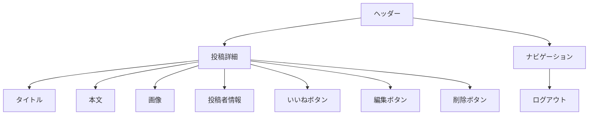

### 6.2 DBへのI/O
- **参照**
  - 投稿情報（postsテーブル）
  - ユーザー情報（usersテーブル）
  - いいね情報（likesテーブル）
  - 画像情報（imagesテーブル）
- **更新**
  - いいね情報（likesテーブル）
- **削除**
  - 投稿情報（postsテーブル）
  - 画像情報（imagesテーブル）

### 6.3 画面遷移
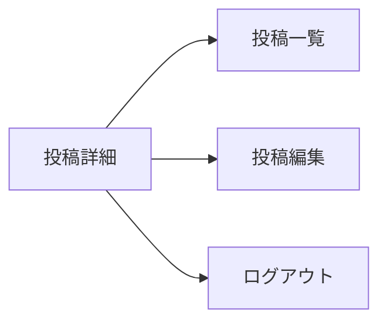

### 6.4 詳細仕様

#### 6.4.1 投稿詳細
- **タイトル**
  - 表示位置: 最上部
  - スタイル: 大見出し
  - 文字サイズ: 24px

- **本文**
  - 表示位置: タイトル下部
  - スタイル: リッチテキスト
  - 文字サイズ: 16px
  - 行間: 1.6
  - 画像表示: レスポンシブ対応

- **投稿者情報**
  - **表示項目**:
    - 投稿者名
    - 投稿日時
    - カテゴリー
  - **表示位置**: 本文下部
  - **スタイル**: グレー文字

- **いいね機能**
  - **ボタン**:
    - アイコン: ハート
    - 状態:
      - 未いいね: 白抜き
      - いいね済み: 赤塗り
    - アニメーション: クリック時
  - **カウント表示**:
    - 位置: ボタン横
    - 更新: リアルタイム

- **アクションボタン**
  - **編集ボタン**:
    - 表示条件: 投稿者本人のみ
    - アイコン: 鉛筆
    - クリック時: 編集画面へ遷移
  - **削除ボタン**:
    - 表示条件: 投稿者本人のみ
    - アイコン: ゴミ箱
    - クリック時: 確認ダイアログ表示

#### 6.4.2 ヘッダー
- **ロゴ**: アプリケーション名
- **ナビゲーション**:
  - 投稿一覧への戻るボタン
  - ユーザー名表示
  - ログアウトボタン

#### 6.4.3 レスポンシブ対応
- **PC**: 中央配置、幅800px
- **タブレット**: 中央配置、幅90%
- **スマートフォン**: 中央配置、幅90%

#### 6.4.4 削除確認ダイアログ
- **表示内容**:
  - タイトル: "投稿の削除"
  - メッセージ: "この投稿を削除してもよろしいですか？"
  - キャンセルボタン
  - 削除ボタン
- **スタイル**: モーダルウィンドウ

## 7. 公開投稿詳細画面（/posts/public/:id）

### 7.1 画面構造
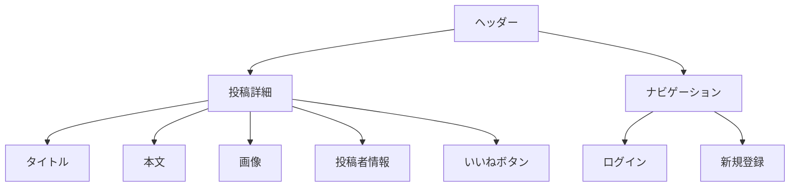

### 7.2 DBへのI/O
- **参照**
  - 投稿情報（postsテーブル）
  - ユーザー情報（usersテーブル）
  - いいね情報（likesテーブル）
  - 画像情報（imagesテーブル）
- **更新**
  - いいね情報（likesテーブル）

### 7.3 画面遷移
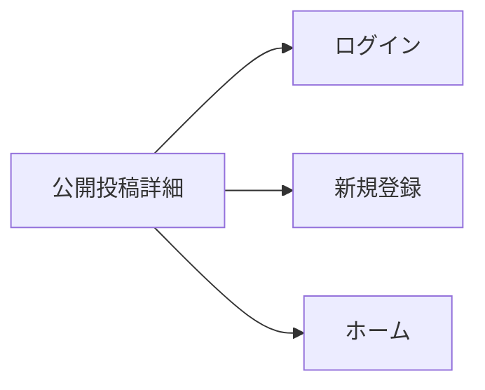

### 7.4 詳細仕様

#### 7.4.1 投稿詳細
- **タイトル**
  - 表示位置: 最上部
  - スタイル: 大見出し
  - 文字サイズ: 24px

- **本文**
  - 表示位置: タイトル下部
  - スタイル: リッチテキスト
  - 文字サイズ: 16px
  - 行間: 1.6
  - 画像表示: レスポンシブ対応

- **投稿者情報**
  - **表示項目**:
    - 投稿者名
    - 投稿日時
    - カテゴリー
  - **表示位置**: 本文下部
  - **スタイル**: グレー文字

- **いいね機能**
  - **ボタン**:
    - アイコン: ハート
    - 状態:
      - 未いいね: 白抜き
      - いいね済み: 赤塗り
    - アニメーション: クリック時
  - **カウント表示**:
    - 位置: ボタン横
    - 更新: リアルタイム
  - **ログイン時**:
    - いいね可能
  - **未ログイン時**:
    - いいね不可
    - クリック時: ログイン画面へ遷移

#### 7.4.2 ヘッダー
- **ロゴ**: アプリケーション名
- **ナビゲーション**:
  - ホームへの戻るボタン
  - ログイン（未ログイン時）
  - 新規登録（未ログイン時）

#### 7.4.3 レスポンシブ対応
- **PC**: 中央配置、幅800px
- **タブレット**: 中央配置、幅90%
- **スマートフォン**: 中央配置、幅90%

#### 7.4.4 関連投稿
- **表示位置**: 投稿詳細下部
- **表示件数**: 3件
- **表示項目**:
  - タイトル
  - 投稿者名
  - 投稿日時
- **選択条件**:
  - 同じカテゴリー
  - 投稿日時の降順 