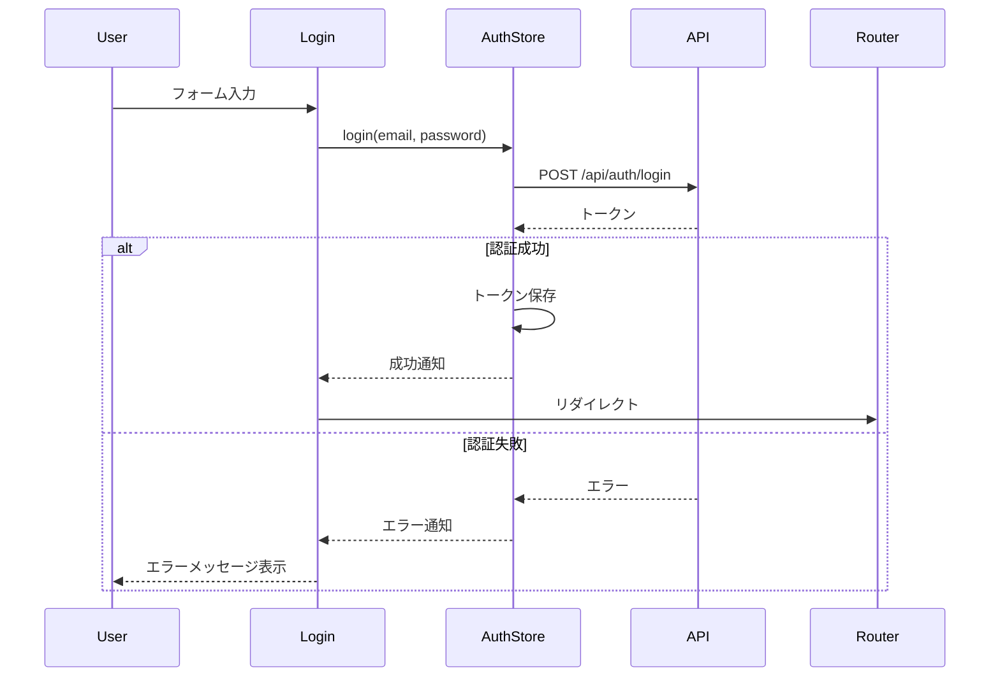
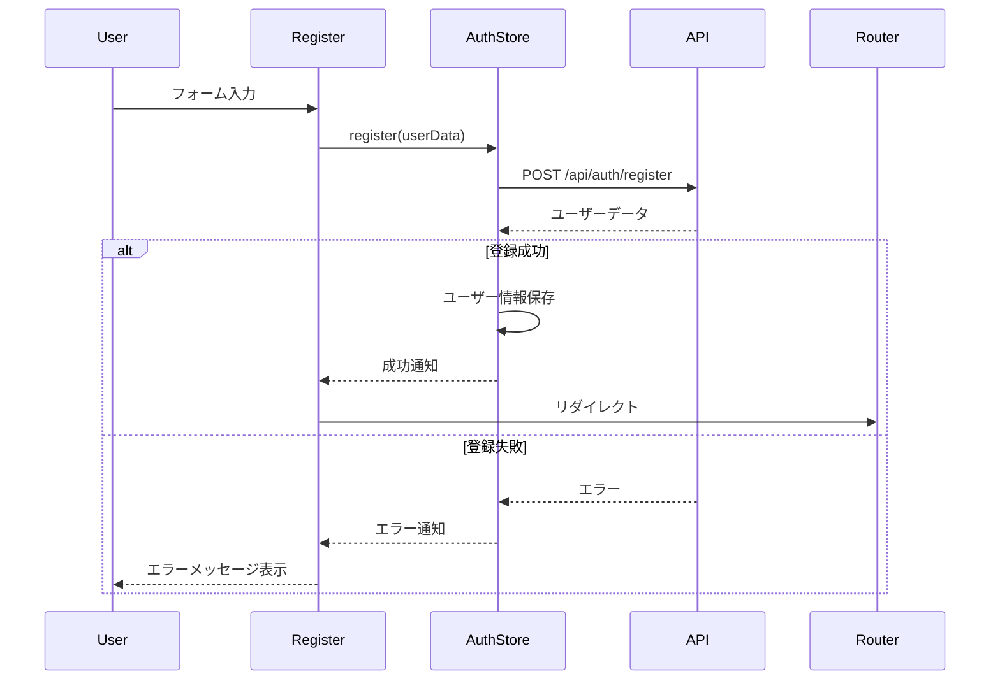

# 認証関連コンポーネント

## Login.vue

### 概要
ユーザーログインフォームコンポーネント。メールアドレスとパスワードによる認証を提供。

### プロパティ
```typescript
interface Props {
    redirectTo?: string;        // ログイン成功後のリダイレクト先
}
```

### イベント
```typescript
interface Emits {
    (e: 'login-success'): void;
    (e: 'login-failed', error: any): void;
}
```

### データフロー


## Register.vue

### 概要
ユーザー登録フォームコンポーネント。新規ユーザー登録機能を提供。

### プロパティ
```typescript
interface Props {
    redirectTo?: string;        // 登録成功後のリダイレクト先
}
```

### イベント
```typescript
interface Emits {
    (e: 'register-success'): void;
    (e: 'register-failed', error: any): void;
}
```

### データフロー


## AuthLayout.vue

### 概要
認証関連ページのレイアウトコンポーネント。ログイン、登録ページの共通レイアウトを提供。

### スロット
```typescript
interface Slots {
    default: () => VNode;      // メインコンテンツ
    header?: () => VNode;      // ヘッダー
    footer?: () => VNode;      // フッター
}
```

### スタイル
```css
.auth-layout {
    min-height: 100vh;
    display: flex;
    flex-direction: column;
    background-color: var(--color-background);
}

.auth-layout__header {
    padding: 1rem;
    border-bottom: 1px solid var(--color-border);
}

.auth-layout__main {
    flex: 1;
    display: flex;
    align-items: center;
    justify-content: center;
    padding: 2rem;
}

.auth-layout__footer {
    padding: 1rem;
    border-top: 1px solid var(--color-border);
    text-align: center;
}
```

## 認証状態管理

### トークン管理
```typescript
const tokenManager = {
    setToken(token: string) {
        localStorage.setItem('auth_token', token);
        axios.defaults.headers.common['Authorization'] = `Bearer ${token}`;
    },
    
    getToken() {
        return localStorage.getItem('auth_token');
    },
    
    removeToken() {
        localStorage.removeItem('auth_token');
        delete axios.defaults.headers.common['Authorization'];
    }
};
```

### 認証状態の永続化
```typescript
const persistAuthState = {
    save(state: AuthState) {
        localStorage.setItem('auth_state', JSON.stringify({
            user: state.user,
            isAuthenticated: state.isAuthenticated,
            expires: Date.now() + 24 * 60 * 60 * 1000 // 24時間
        }));
    },
    
    load(): AuthState | null {
        const saved = localStorage.getItem('auth_state');
        if (!saved) return null;
        
        const state = JSON.parse(saved);
        if (Date.now() > state.expires) {
            localStorage.removeItem('auth_state');
            return null;
        }
        
        return state;
    }
};
```

## ルートガード

### 認証必須ルート
```typescript
const authGuard = async (to: RouteLocationNormalized) => {
    const authStore = useAuthStore();
    
    if (to.meta.requiresAuth && !authStore.isAuthenticated) {
        return {
            path: '/auth/login',
            query: { redirect: to.fullPath }
        };
    }
    
    return true;
};
```

### ゲスト専用ルート
```typescript
const guestGuard = async (to: RouteLocationNormalized) => {
    const authStore = useAuthStore();
    
    if (to.meta.guestOnly && authStore.isAuthenticated) {
        return { path: '/' };
    }
    
    return true;
};
```

## エラーハンドリング

### 認証エラー
```typescript
const handleAuthError = (error: any) => {
    if (error.response?.status === 401) {
        // トークン無効
        authStore.logout();
        router.push('/auth/login');
    } else if (error.response?.status === 422) {
        // バリデーションエラー
        return error.response.data.errors;
    } else {
        // その他のエラー
        showError('認証処理中にエラーが発生しました');
    }
};
```

### トークン更新
```typescript
const refreshToken = async () => {
    try {
        const response = await api.post('/api/auth/refresh');
        tokenManager.setToken(response.data.access_token);
        return true;
    } catch (error) {
        tokenManager.removeToken();
        return false;
    }
};
```

## セキュリティ対策

### XSS対策
```typescript
const sanitizeInput = (input: string) => {
    return input
        .replace(/&/g, '&amp;')
        .replace(/</g, '&lt;')
        .replace(/>/g, '&gt;')
        .replace(/"/g, '&quot;')
        .replace(/'/g, '&#039;');
};
```

### CSRF対策
```typescript
const setupCSRF = () => {
    const token = document.querySelector('meta[name="csrf-token"]')?.getAttribute('content');
    if (token) {
        axios.defaults.headers.common['X-CSRF-TOKEN'] = token;
    }
};
```

### パスワード強度チェック
```typescript
const checkPasswordStrength = (password: string) => {
    const hasMinLength = password.length >= 8;
    const hasUpperCase = /[A-Z]/.test(password);
    const hasLowerCase = /[a-z]/.test(password);
    const hasNumbers = /\d/.test(password);
    const hasSpecialChar = /[!@#$%^&*(),.?":{}|<>]/.test(password);
    
    return {
        isStrong: hasMinLength && hasUpperCase && hasLowerCase && hasNumbers && hasSpecialChar,
        criteria: {
            length: hasMinLength,
            upperCase: hasUpperCase,
            lowerCase: hasLowerCase,
            numbers: hasNumbers,
            specialChar: hasSpecialChar
        }
    };
};
``` 