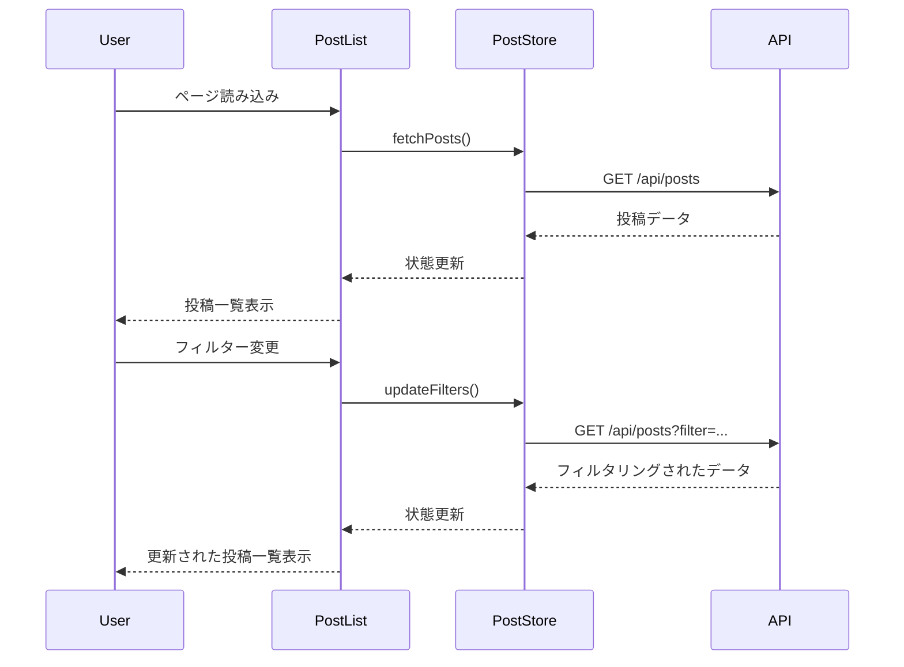
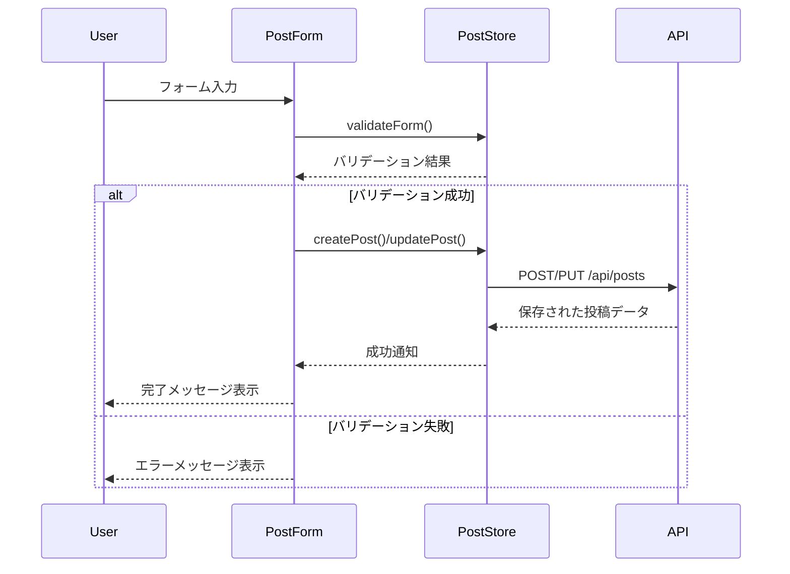
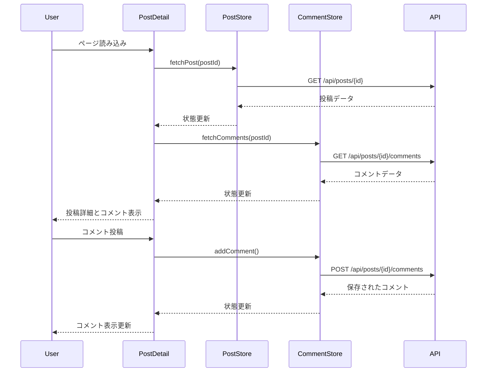
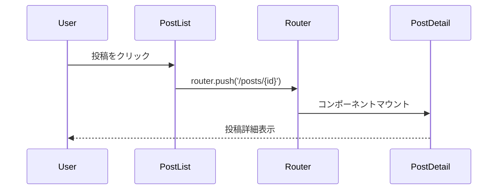
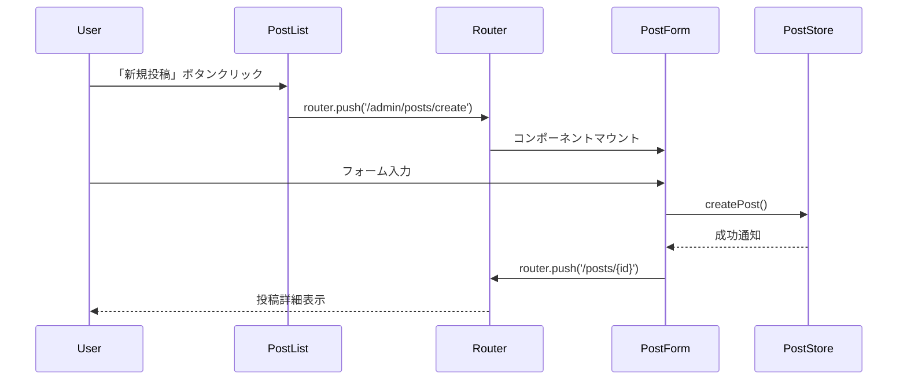

# 投稿関連コンポーネント

## PostList.vue

### 概要
投稿一覧を表示するコンポーネント。ページネーション、フィルタリング、ソート機能を提供。

### プロパティ
```typescript
interface Props {
    initialPosts?: Post[];      // 初期投稿データ
    pagination?: Pagination;    // ページネーション情報
    filters?: PostFilters;      // フィルター条件
}
```

### イベント
```typescript
interface Emits {
    (e: 'update:filters', filters: PostFilters): void;
    (e: 'load-more'): void;
}
```

### データフロー


## PostForm.vue

### 概要
投稿の作成・編集フォームコンポーネント。マークダウンエディタ、画像アップロード、タグ選択機能を提供。

### プロパティ
```typescript
interface Props {
    post?: Post;               // 編集対象の投稿データ
    mode: 'create' | 'edit';   // 作成/編集モード
}
```

### イベント
```typescript
interface Emits {
    (e: 'submit', postData: PostCreateData | PostUpdateData): void;
    (e: 'cancel'): void;
}
```

### データフロー


## PostDetail.vue

### 概要
投稿の詳細を表示するコンポーネント。コメント表示、いいね機能、シェア機能を提供。

### プロパティ
```typescript
interface Props {
    postId: number;            // 投稿ID
}
```

### イベント
```typescript
interface Emits {
    (e: 'comment-added', comment: Comment): void;
    (e: 'like-toggled', liked: boolean): void;
}
```

### データフロー


## コンポーネント間の連携

### 投稿一覧から詳細への遷移


### 投稿作成フロー


## エラーハンドリング

### 投稿取得エラー
```typescript
const handlePostFetchError = (error: any) => {
    if (error.response?.status === 404) {
        showError('投稿が見つかりません');
        router.push('/');
    } else {
        showError('投稿の取得に失敗しました');
    }
};
```

### 投稿保存エラー
```typescript
const handlePostSaveError = (error: any) => {
    if (error.response?.status === 422) {
        // バリデーションエラー
        const errors = error.response.data.errors;
        Object.keys(errors).forEach(key => {
            formErrors.value[key] = errors[key][0];
        });
    } else {
        showError('投稿の保存に失敗しました');
    }
};
```

## パフォーマンス最適化

### 投稿一覧の仮想スクロール
```typescript
const virtualList = {
    items: computed(() => posts.value),
    itemHeight: 200,
    buffer: 5,
    renderItem: (item: Post) => h(PostCard, { post: item })
};
```

### 画像の遅延読み込み
```typescript
const lazyLoadImage = (el: HTMLImageElement) => {
    const observer = new IntersectionObserver((entries) => {
        entries.forEach(entry => {
            if (entry.isIntersecting) {
                el.src = el.dataset.src || '';
                observer.unobserve(el);
            }
        });
    });
    observer.observe(el);
};
```

### コメントの遅延読み込み
```typescript
const loadComments = async () => {
    if (loading.value || !hasMore.value) return;
    loading.value = true;
    try {
        const response = await commentStore.fetchMoreComments();
        hasMore.value = response.data.length > 0;
    } finally {
        loading.value = false;
    }
};
``` 