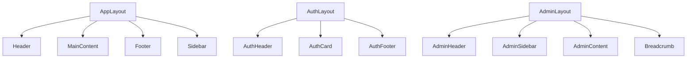
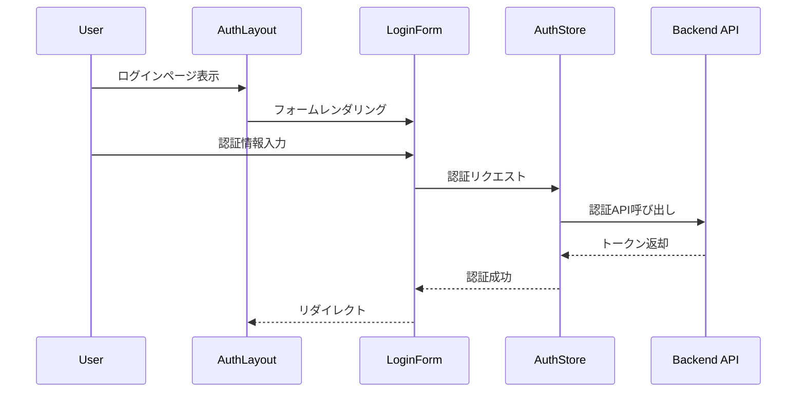
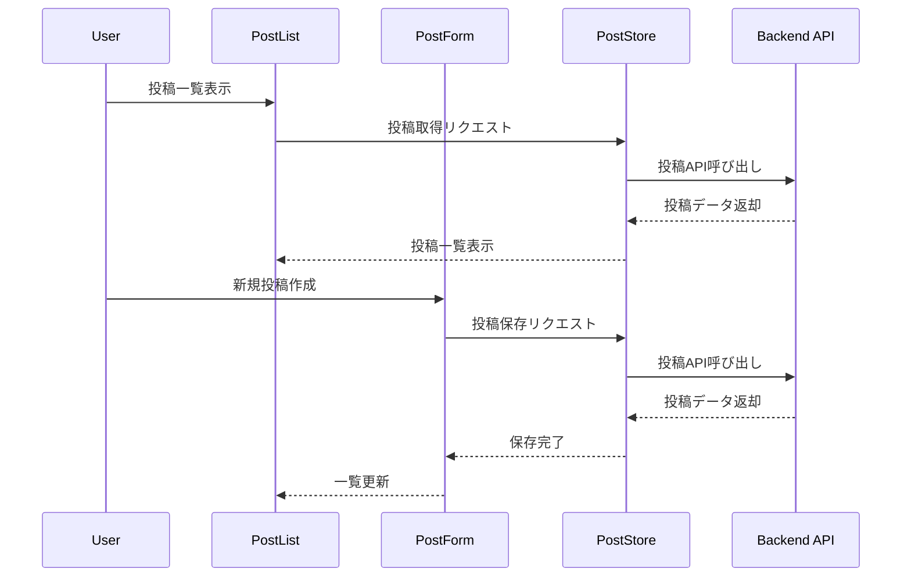
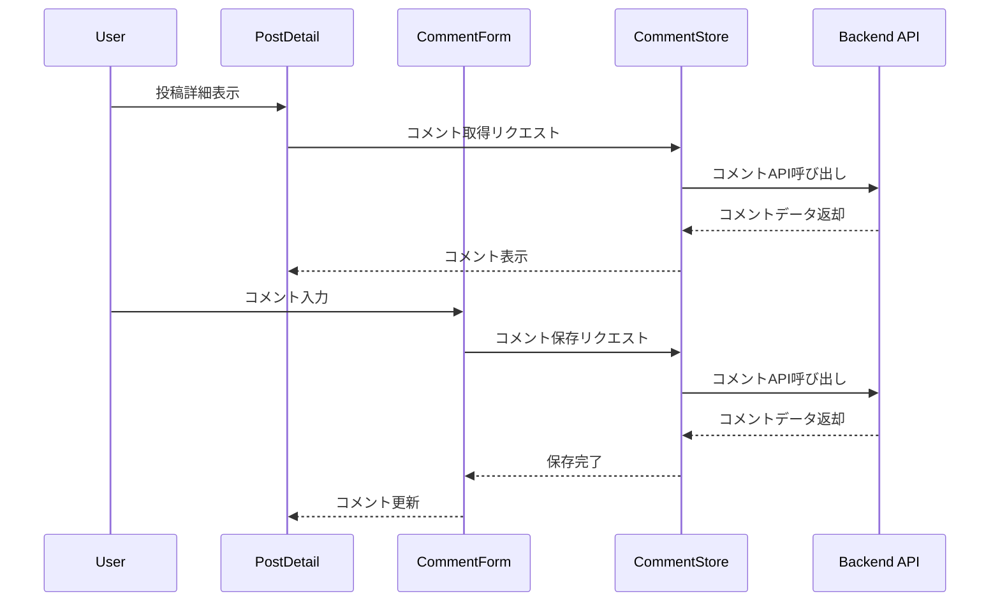
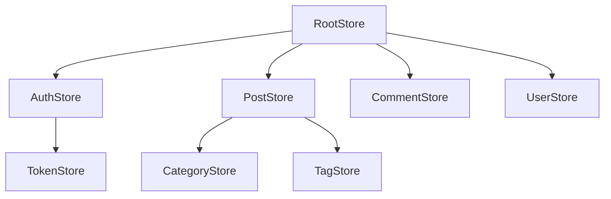

# コンポーネント間の関係性

## レイアウト階層



## コンポーネントの依存関係

### レイアウトコンポーネント
- `AppLayout`は以下のコンポーネントに依存：
  - `Header` - ナビゲーションとユーザー情報
  - `Sidebar` - メニューナビゲーション
  - `Footer` - フッター情報

- `AuthLayout`は以下のコンポーネントに依存：
  - `AuthHeader` - ロゴとタイトル
  - `AuthCard` - 認証フォームのコンテナ
  - `AuthFooter` - 認証関連リンク

- `AdminLayout`は以下のコンポーネントに依存：
  - `AdminHeader` - 管理画面ヘッダー
  - `AdminSidebar` - 管理メニュー
  - `Breadcrumb` - ナビゲーション階層

### 共通コンポーネント
- `Button`は以下のコンポーネントで使用：
  - `Header` - ログインボタン
  - `AuthCard` - フォーム送信ボタン
  - `Modal` - アクションボタン

- `Input`は以下のコンポーネントで使用：
  - `AuthCard` - ログインフォーム
  - `PostForm` - 投稿フォーム
  - `CommentForm` - コメントフォーム

- `Card`は以下のコンポーネントで使用：
  - `PostList` - 投稿カード
  - `UserProfile` - プロフィールカード
  - `CategoryList` - カテゴリーカード

## データフロー

### 認証フロー


### 投稿フロー


### コメントフロー


## 状態管理

### Pinia Storeの関係性


### Storeの依存関係
- `AuthStore`は`TokenStore`に依存
- `PostStore`は`CategoryStore`と`TagStore`に依存
- `CommentStore`は`PostStore`と`UserStore`に依存

## コンポーネントの再利用性

### 共通コンポーネント
- `Button` - 全ページで使用可能
- `Input` - フォーム全般で使用可能
- `Card` - コンテンツ表示全般で使用可能
- `Modal` - ポップアップ表示全般で使用可能
- `Pagination` - リスト表示全般で使用可能
- `Loading` - ローディング表示全般で使用可能

### レイアウトコンポーネント
- `AppLayout` - 一般ページ用
- `AuthLayout` - 認証関連ページ用
- `AdminLayout` - 管理画面用

## パフォーマンス最適化

### コンポーネントの遅延読み込み
```typescript
// ルーティング設定
const routes = [
    {
        path: '/admin',
        component: () => import('@/layouts/AdminLayout.vue'),
        children: [
            {
                path: 'posts',
                component: () => import('@/views/admin/PostList.vue')
            }
        ]
    }
];
```

### コンポーネントのメモ化
```typescript
// メモ化されたコンポーネント
const MemoizedPostCard = defineComponent({
    name: 'MemoizedPostCard',
    props: {
        post: {
            type: Object as PropType<Post>,
            required: true
        }
    },
    setup(props) {
        return () => h(PostCard, { post: props.post });
    }
});
``` 