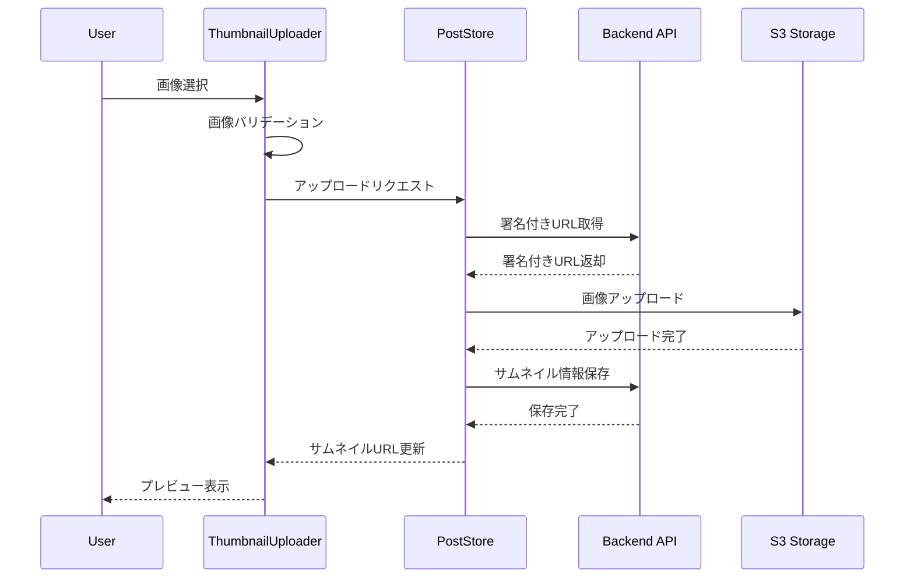

# サムネイル画像設定機能

## 概要
記事のサムネイル画像を設定・管理する機能を提供します。

## コンポーネント構成

### ThumbnailUploader.vue
```typescript
interface Props {
    postId: number;                    // 投稿ID
    initialThumbnail?: string;         // 初期サムネイルURL
    aspectRatio?: string;              // アスペクト比（例: "16:9"）
    maxSize?: number;                  // 最大ファイルサイズ（MB）
    allowedTypes?: string[];           // 許可するファイルタイプ
}

interface Emits {
    (e: 'update:thumbnail', url: string): void;
    (e: 'error', error: Error): void;
}
```

### ThumbnailPreview.vue
```typescript
interface Props {
    thumbnailUrl: string;              // サムネイルURL
    alt?: string;                      // 代替テキスト
    size?: 'sm' | 'md' | 'lg';        // プレビューサイズ
    showRemove?: boolean;              // 削除ボタン表示
}

interface Emits {
    (e: 'remove'): void;
}
```

## データフロー



## 機能詳細

### 1. 画像アップロード
- ドラッグ&ドロップ対応
- クリックでのファイル選択
- 複数ファイル選択時の最初の1枚のみ使用
- 画像のプレビュー表示

### 2. バリデーション
```typescript
const validateImage = (file: File): boolean => {
    // ファイルサイズチェック
    if (file.size > maxSize * 1024 * 1024) {
        throw new Error('ファイルサイズが大きすぎます');
    }

    // ファイルタイプチェック
    if (!allowedTypes.includes(file.type)) {
        throw new Error('許可されていないファイル形式です');
    }

    // 画像サイズチェック
    return new Promise((resolve) => {
        const img = new Image();
        img.onload = () => {
            const aspect = img.width / img.height;
            resolve(Math.abs(aspect - targetAspect) < 0.1);
        };
        img.src = URL.createObjectURL(file);
    });
};
```

### 3. 画像処理
```typescript
const processImage = async (file: File): Promise<Blob> => {
    // 画像のリサイズ
    const canvas = document.createElement('canvas');
    const ctx = canvas.getContext('2d');
    const img = await createImageBitmap(file);

    // アスペクト比を維持してリサイズ
    const { width, height } = calculateDimensions(img.width, img.height);
    canvas.width = width;
    canvas.height = height;
    ctx?.drawImage(img, 0, 0, width, height);

    // WebP形式に変換
    return new Promise((resolve) => {
        canvas.toBlob((blob) => resolve(blob!), 'image/webp', 0.8);
    });
};
```

### 4. ストレージ管理
```typescript
interface ThumbnailStorage {
    upload: (file: File) => Promise<string>;
    delete: (url: string) => Promise<void>;
    getUrl: (key: string) => string;
}

class S3ThumbnailStorage implements ThumbnailStorage {
    private readonly bucket: string;
    private readonly region: string;

    async upload(file: File): Promise<string> {
        // 署名付きURLの取得
        const { url, key } = await this.getSignedUrl();
        
        // S3へのアップロード
        await fetch(url, {
            method: 'PUT',
            body: file,
            headers: {
                'Content-Type': file.type
            }
        });

        return this.getUrl(key);
    }

    // その他のメソッド実装...
}
```

## スタイル
```css
.thumbnail-uploader {
    position: relative;
    border: 2px dashed var(--color-border);
    border-radius: 0.5rem;
    padding: 2rem;
    text-align: center;
    transition: all 0.2s;
    
    &:hover {
        border-color: var(--color-primary);
        background-color: var(--color-background-light);
    }
    
    &--dragging {
        border-color: var(--color-primary);
        background-color: var(--color-primary-light);
    }
}

.thumbnail-preview {
    position: relative;
    overflow: hidden;
    border-radius: 0.5rem;
    
    &__image {
        width: 100%;
        height: 100%;
        object-fit: cover;
    }
    
    &__remove {
        position: absolute;
        top: 0.5rem;
        right: 0.5rem;
        background-color: rgba(0, 0, 0, 0.5);
        color: white;
        border: none;
        border-radius: 50%;
        width: 2rem;
        height: 2rem;
        display: flex;
        align-items: center;
        justify-content: center;
        cursor: pointer;
        transition: all 0.2s;
        
        &:hover {
            background-color: var(--color-danger);
        }
    }
}
```

## エラーハンドリング
```typescript
const handleUploadError = (error: Error) => {
    switch (error.message) {
        case 'FILE_TOO_LARGE':
            showError('ファイルサイズが大きすぎます');
            break;
        case 'INVALID_FILE_TYPE':
            showError('許可されていないファイル形式です');
            break;
        case 'UPLOAD_FAILED':
            showError('アップロードに失敗しました');
            break;
        default:
            showError('予期せぬエラーが発生しました');
    }
};
```

## パフォーマンス最適化
1. 画像の遅延読み込み
2. WebP形式への変換
3. 適切なサイズへのリサイズ
4. キャッシュの活用

## セキュリティ対策
1. ファイルタイプの厳密なチェック
2. ファイルサイズの制限
3. 画像のサニタイズ
4. 署名付きURLの使用 