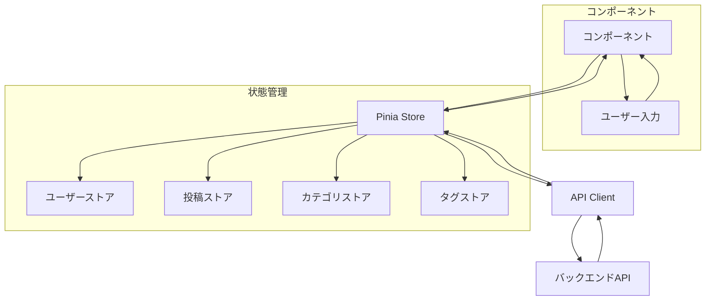

# フロントエンド構造

## ディレクトリ構造

```
resources/
├── js/
│   ├── components/          # 再利用可能なコンポーネント
│   │   ├── common/         # 共通コンポーネント
│   │   ├── layout/         # レイアウトコンポーネント
│   │   └── features/       # 機能別コンポーネント
│   ├── views/              # ページコンポーネント
│   ├── store/              # Piniaストア
│   │   ├── modules/       # ストアモジュール
│   │   └── index.js       # ストアの設定
│   ├── router/            # ルーティング設定
│   ├── composables/       # コンポジション関数
│   ├── utils/             # ユーティリティ関数
│   ├── api/               # APIクライアント
│   └── App.vue            # ルートコンポーネント
└── css/
    └── app.css            # グローバルスタイル
```

## データフロー



## 主要コンポーネント

### レイアウトコンポーネント
- `AppLayout.vue`: メインレイアウト
- `AuthLayout.vue`: 認証用レイアウト
- `AdminLayout.vue`: 管理画面用レイアウト

### 共通コンポーネント
- `Button.vue`: ボタンコンポーネント
- `Input.vue`: 入力フィールド
- `Card.vue`: カードコンポーネント
- `Modal.vue`: モーダルダイアログ
- `Pagination.vue`: ページネーション
- `Loading.vue`: ローディング表示

### 機能コンポーネント
- `PostList.vue`: 投稿一覧
- `PostForm.vue`: 投稿作成・編集
- `PostDetail.vue`: 投稿詳細
- `CommentList.vue`: コメント一覧
- `CommentForm.vue`: コメント投稿
- `CategoryList.vue`: カテゴリ一覧
- `TagList.vue`: タグ一覧
- `MediaUploader.vue`: メディアアップロード

## 状態管理（Pinia）

### ユーザーストア
```typescript
interface UserState {
    user: User | null;
    token: string | null;
    isAuthenticated: boolean;
}

interface User {
    id: number;
    name: string;
    email: string;
    created_at: string;
    updated_at: string;
}
```

### 投稿ストア
```typescript
interface PostState {
    posts: Post[];
    currentPost: Post | null;
    pagination: Pagination;
    loading: boolean;
}

interface Post {
    id: number;
    title: string;
    content: string;
    slug: string;
    published: boolean;
    published_at: string | null;
    user_id: number;
    category_id: number | null;
    tags: Tag[];
    created_at: string;
    updated_at: string;
}
```

### カテゴリストア
```typescript
interface CategoryState {
    categories: Category[];
    currentCategory: Category | null;
    loading: boolean;
}

interface Category {
    id: number;
    name: string;
    slug: string;
    parent_id: number | null;
    created_at: string;
    updated_at: string;
}
```

### タグストア
```typescript
interface TagState {
    tags: Tag[];
    currentTag: Tag | null;
    loading: boolean;
}

interface Tag {
    id: number;
    name: string;
    slug: string;
    created_at: string;
    updated_at: string;
}
```

## APIクライアント

### 認証関連
```typescript
interface AuthAPI {
    login(email: string, password: string): Promise<LoginResponse>;
    logout(): Promise<void>;
    register(userData: RegisterData): Promise<RegisterResponse>;
    getCurrentUser(): Promise<User>;
}

interface LoginResponse {
    access_token: string;
    token_type: string;
    expires_in: number;
}
```

### 投稿関連
```typescript
interface PostAPI {
    getPosts(params?: PostQueryParams): Promise<PostListResponse>;
    getPost(id: number): Promise<Post>;
    createPost(postData: PostCreateData): Promise<Post>;
    updatePost(id: number, postData: PostUpdateData): Promise<Post>;
    deletePost(id: number): Promise<void>;
}

interface PostQueryParams {
    page?: number;
    per_page?: number;
    category?: number;
    tag?: number;
    search?: string;
}
```

### コメント関連
```typescript
interface CommentAPI {
    getComments(postId: number): Promise<Comment[]>;
    createComment(postId: number, content: string): Promise<Comment>;
    updateComment(id: number, content: string): Promise<Comment>;
    deleteComment(id: number): Promise<void>;
}
```

## ルーティング

```typescript
const routes = [
    {
        path: '/',
        component: AppLayout,
        children: [
            {
                path: '',
                name: 'home',
                component: PostList
            },
            {
                path: 'posts/:id',
                name: 'post-detail',
                component: PostDetail
            },
            {
                path: 'categories',
                name: 'categories',
                component: CategoryList
            },
            {
                path: 'tags',
                name: 'tags',
                component: TagList
            }
        ]
    },
    {
        path: '/auth',
        component: AuthLayout,
        children: [
            {
                path: 'login',
                name: 'login',
                component: Login
            },
            {
                path: 'register',
                name: 'register',
                component: Register
            }
        ]
    },
    {
        path: '/admin',
        component: AdminLayout,
        meta: { requiresAuth: true },
        children: [
            {
                path: 'posts',
                name: 'admin-posts',
                component: AdminPostList
            },
            {
                path: 'posts/create',
                name: 'admin-post-create',
                component: PostForm
            },
            {
                path: 'posts/:id/edit',
                name: 'admin-post-edit',
                component: PostForm
            }
        ]
    }
];
```

## エラーハンドリング

### グローバルエラーハンドラ
```typescript
const errorHandler = {
    handle(error: any) {
        if (error.response) {
            switch (error.response.status) {
                case 401:
                    // 認証エラー
                    store.auth.logout();
                    router.push('/auth/login');
                    break;
                case 403:
                    // 権限エラー
                    showError('アクセス権限がありません');
                    break;
                case 404:
                    // リソース未検出
                    showError('リソースが見つかりません');
                    break;
                case 422:
                    // バリデーションエラー
                    handleValidationError(error.response.data.errors);
                    break;
                default:
                    // その他のエラー
                    showError('予期せぬエラーが発生しました');
            }
        } else {
            showError('ネットワークエラーが発生しました');
        }
    }
};
```

## パフォーマンス最適化

1. コンポーネントの遅延読み込み
```typescript
const PostDetail = () => import('@/views/PostDetail.vue');
```

2. 画像の遅延読み込み
```html

```

3. 無限スクロール
```typescript
const loadMore = async () => {
    if (loading.value || !hasMore.value) return;
    loading.value = true;
    try {
        const response = await postStore.fetchMorePosts();
        hasMore.value = response.data.length > 0;
    } finally {
        loading.value = false;
    }
};
```

4. キャッシュ戦略
```typescript
const cache = {
    set(key: string, data: any, ttl: number = 300) {
        localStorage.setItem(key, JSON.stringify({
            data,
            expires: Date.now() + ttl * 1000
        }));
    },
    get(key: string) {
        const item = localStorage.getItem(key);
        if (!item) return null;
        const { data, expires } = JSON.parse(item);
        if (Date.now() > expires) {
            localStorage.removeItem(key);
            return null;
        }
        return data;
    }
};
``` 